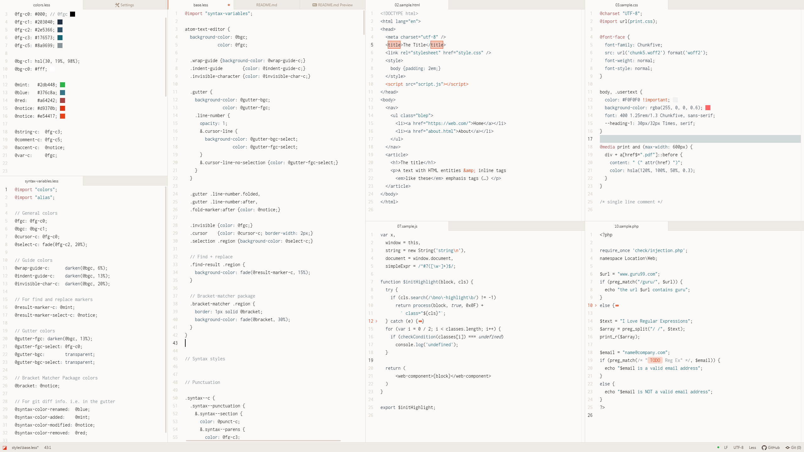

# anode-syntax theme

An ascetic light syntax theme for Atom, part of Moth's [FONC YOU](https://germanponte.com/moth/foncyou/) collection.

The luminous counterpart of Cathode, distilled into undiluted simplicity. WARNING: may contain traces of blue static.

`Font: Inconsolata / UI: One Light / CSS colors: highlight-colors by brumm (not part of the theme)`

Anode aims for unabashed clarity, ideal for programming your world-[saving / dominating] AIs from Moonbase Alpha.

## Features

+ Blue palette.
+ High contrast.
+ High brightness.
+ Discreet highlighting.
+ Rare color accent.
+ Practical approach.

## Installation

+ In Atom, go to *Settings* > *Install*.
+ Click the `Themes` button and search for `anode`.
+ Browse the results for `anode-syntax` and click `Install`.
+ Go back to *Settings*, click *Themes*.
+ In the drop-down menu under "Syntax Theme", choose "anode-syntax".

## FONC YOU

Moth's FONC YOU (Few Or No Colors Yield Optimal Usage) collection is a sedate approach to Atom syntax highlighting for those who wish to engage in chromatic austerity.

Dark themes:

+ [Cathode](https://github.com/moth-g/cathode-syntax)
+ [Moth One](https://github.com/moth-g/moth-one-syntax)
+ [Moth Mono](https://github.com/moth-g/moth-mono-syntax)
+ [Moth Dark](https://github.com/moth-g/moth-dark-syntax)

Light Themes:

+ *Anode*
+ [Moth Light](https://github.com/moth-g/moth-light-syntax)

Learn more and see the themes in action at the [FONC YOU web page](https://germanponte.com/moth/foncyou/).
